# Proyecto de Obra Social - API con Java + Quarkus

Somos el grupo 9 y este es el trabajo práctico integrador de la academia Java + React 2024 de UMSA con Softtek y hemos creado este proyecto modelando una obra social. Esta obra social tiene pacientes, especialistas y turnos y recetas medicas, permitiendo que un paciente pueda sacar un turno relacionado a un especialista específico. La API está documentada utilizando Swagger y se proporciona una colección de Postman para facilitar las pruebas. Esta es la documentación correspondiente al backend; pronto incorporaremos el frontend con su apartado correspondiente.

## Integrantes del Proyecto

- **Javier Kuznik**
- **Nicolas Torres**
- **Joaquin Muñoz**


## Entidades creadas

- **Pacientes**
- **Especialistas**
- **Turnos**
- **Receta medica**
- **Ubicaciones del especialista**
- **Horarios**

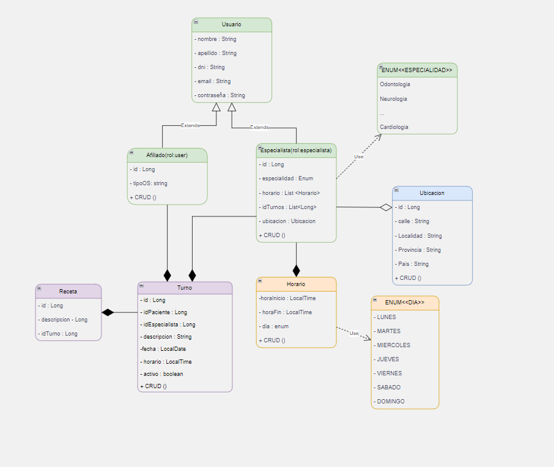

## Tecnologías

- **Java 17** como lenguaje de programación.
- **Quarkus**: Framework para la creación y ejecución del proyecto.
- **Maven**: Para instalar las dependencias del proyecto.
- **Postman**: Para pruebas de la API mediante una URL y body con los datos correspondientes.

### Dependencias utilizadas
- **Swagger**: Para la documentación de cada método implementado en la API.
- **RESTEasy**: Para construir la API REST.
- **Lombok**: Para reducir el código repetitivo y mejorar la legibilidad.
- **Validation**: Para validaciones de datos de forma más eficiente.
- **H2**: Base de datos en memoria para una mayor velocidad a la hora de probar y correr el proyecto.

## Estructura del Proyecto

El proyecto sigue el patrón de diseño MVC (Modelo-Vista-Controlador) y está dividido en paquetes según su funcionalidad:

- **controller**: Controladores REST.
- **service**: Servicios con interfaces para especificar su funcionalidad y mantener un orden.
- **repository**: Repositorios para acceso a datos.
- **model**: Modelos de datos.
- **dto**: Objetos de Transferencia de Datos (DTOs).

## Implementación de los servicios

Los servicios están diseñados con interfaces e implementados para permitir una mayor flexibilidad y modularidad.

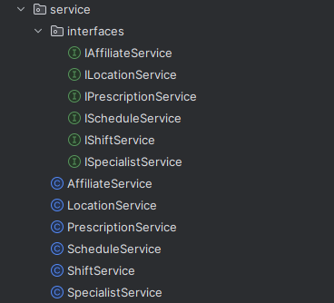

## Requisitos

- **Java 17 o superior**
- **Tener Maven instalado**
- **Terminal para correr el proyecto**
- **Postman o navegador para probar la API**

## Instrucciones para Ejecutar el Proyecto

1. **Primero hay que descargar el repositorio, para ello usamos el comando con la url del proyecto.**

   ```bash
   git clone https://github.com/nicolasjitorres/UMSA_grupo_9/tree/main
   ```
2. **Usar el comando en la linea de comandos para iniciar el proyecto, en este caso para powershell es**

    ```bash
    ./mvn compile quarkus:dev
    ```
3. **¡Listo para probar!**

- **Opción 1:**
  Abre el [archivo de la colección](https://github.com/nicolasjitorres/UMSA_grupo_9/blob/develop/BackendSofftek/obrasocial.postman_collection.json) que se encuentra subido en el repositorio para hacer las pruebas desde la herramienta POSTMAN.

- **Opción 2:**
  Ve a la dirección [http://localhost:8080/swagger-ui/index.html#/](http://localhost:8080/swagger-ui/index.html#/) y prueba desde la interfaz de Swagger, que está documentada con cada endpoint respectivo (declarando las posibles respuestas que puede dar).

## Implementación del Swagger

Al correr el proyecto podemos ingresar a esta web de swagger de forma local, la cual consta de la documentación de cada metodo e información de los integrantes del proyecto.


Cada entidad del sistema cuenta con su respectiva documentación de cada método y de como usarse.


Dentro de Swagger, podemos probar cada método de la API. Dentro de cada método, encontrarás información relevante que debes tener en cuenta. Esto puede incluir detalles sobre los parámetros de entrada, el formato de los datos esperados, ejemplos de solicitudes y respuestas, y cualquier otra información útil para interactuar con la API de manera efectiva.


Cada método devuelve un código de estado HTTP diferente según sea necesario. En nuestro caso, optamos por trabajar con los siguientes códigos:

- **200**: Se ha traído o utilizado este objeto correctamente.
- **204**: Para cuando hacemos un GET pero no hay datos en el sistema.
- **400**: Error debido a alguna validación.
- **404**: Se ha proporcionado una ID de alguna entidad que no existe en el sistema.

## Frontend

El frontend de este proyecto ha sido desarrollado utilizando React y TypeScript, proporcionando una interfaz de usuario moderna y fácil de usar para interactuar con la API de la obra social.

### Tecnologías

- **React**: Biblioteca de JavaScript para construir interfaces de usuario.
- **TypeScript**: Lenguaje de programación que se basa en JavaScript y añade tipos estáticos.
- **Material-UI**: Biblioteca de componentes de interfaz de usuario para React.
- **Redux**: Biblioteca para el manejo del estado global de la aplicación.
- **Vite**: Herramienta de construcción rápida para proyectos de frontend.
- **Axios**: Para hacer peticiones HTTP a la API.


### Dependencias Utilizadas

- **redux-toolkit**: Herramientas y utilidades para simplificar el uso de Redux.
- **date-fns**: Librería moderna para manejo de fechas en JavaScript. Ofrece funciones para el parseo, manipulación y formateo de fechas, así como para trabajar con zonas horarias.
- **jspdf**: Biblioteca JavaScript para generar documentos PDF de manera dinámica en el navegador. Permite la creación de documentos PDF con texto, imágenes y gráficos generados desde datos en formato JSON.
- **sweetalert2**: Biblioteca para mostrar ventanas modales de alerta, confirmación y entrada de forma elegante y personalizable en aplicaciones web. Ofrece una experiencia de usuario mejorada en comparación con los diálogos estándar del navegador.
- **yup**: Para validación de formularios.
- **material-ui/icons**: Iconos para la interfaz de usuario.

### Estructura del Proyecto

El proyecto sigue una estructura organizada por componentes y características, facilitando su mantenimiento y escalabilidad:

- **components**: Componentes reutilizables en la aplicación.
- **pages**: Páginas principales de la aplicación.
- **redux**: Configuración y slices de Redux.
- **routes**: Definición de rutas de la aplicación.
- **services**: Servicios para interactuar con la API.
- **hooks**: Custom hooks para lógica reutilizable.

### Instalación y Ejecución del Proyecto

Para instalar y ejecutar el frontend del proyecto, sigue estos pasos:


1. **Navegar al directorio del frontend:**

    ```bash
    cd frontend
    ```

2. **Instalar las dependencias:**

    ```bash
    npm install
    ```

3. **Iniciar la aplicación:**

    ```bash
    npm run dev
    ```

### Funcionalidades

- **Inicio de sesión**: Permite a los usuarios autenticarse en el sistema, momentaneamente el login solo está hecho visualmente sin logica pero la idea es dejarlo preparado para incorporar usuarios y permisos (JWT de fondo).
- **Gestión de Afiliados**: Listado, creación, edición y eliminación de afiliados.
- **Gestión de Especialistas**: Listado, creación, edición y eliminación de especialistas.
- **Gestión de Turnos**: Agendar, modificar y cancelar turnos.
- **Gestión de Recetas Médicas**: Creación, modificación, eliminición y visualización de recetas médicas.
- **Consulta de Horarios**: Visualización de los horarios disponibles para los especialistas.

### Capturas de Pantalla

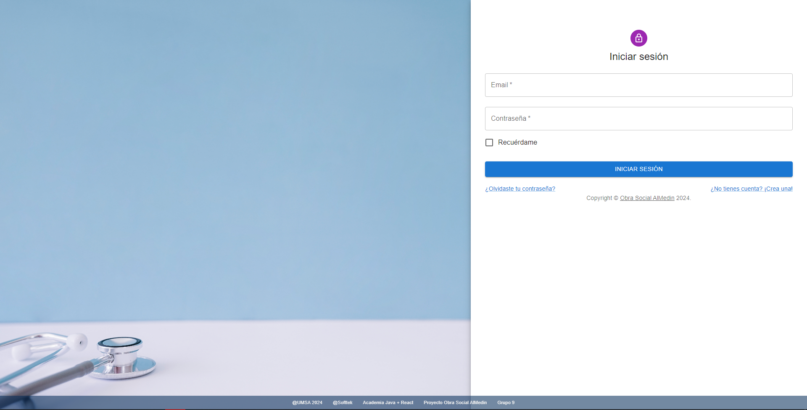
*Pantalla de Inicio de Sesión*


*Gestión de afiliados*


Los campos tienen las validaciones correspondientes, en este caso se muestra el caso de no poder ingresar campos vacíos.
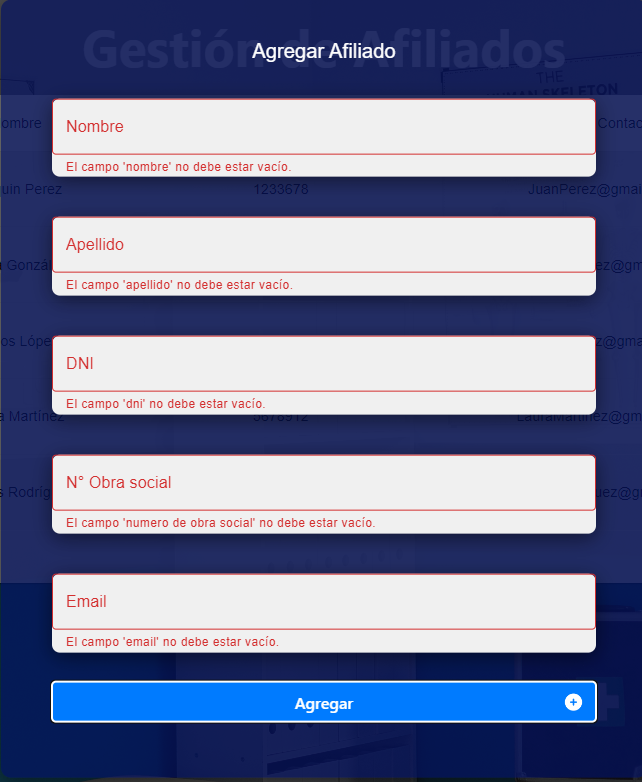
*Agregar de afiliados*

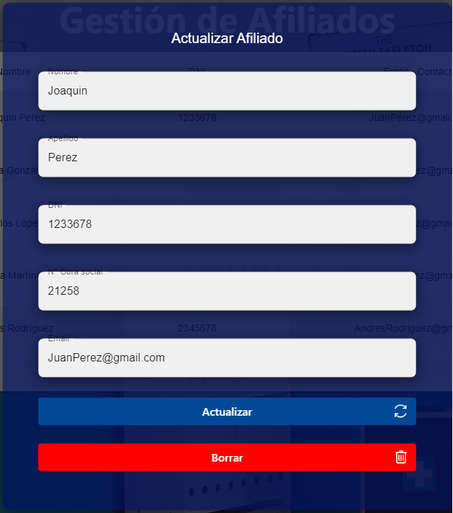
*Actualizar de afiliados*


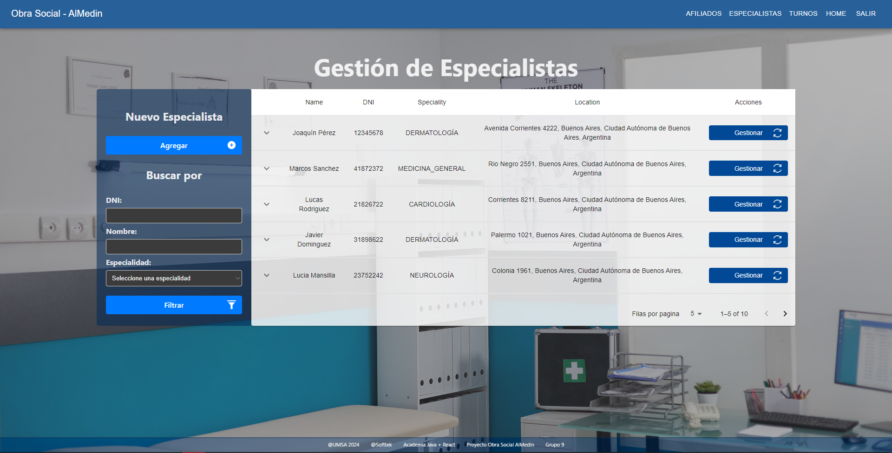
*Gestión de Especialistas*

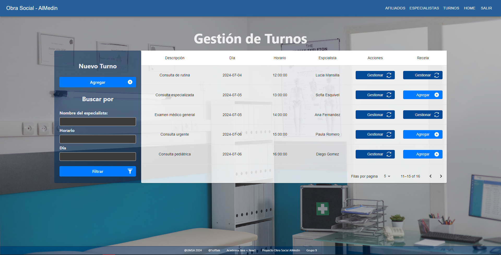
*Gestión de Turnos*

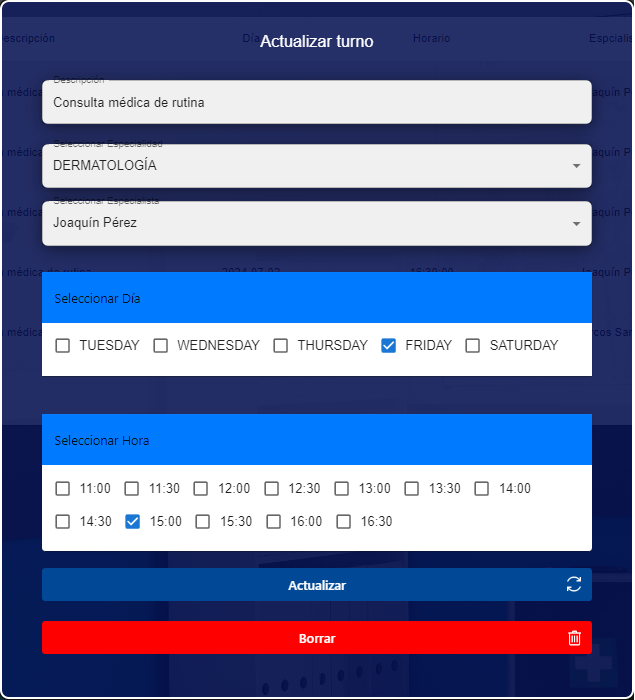
*Actualizar Turnos*

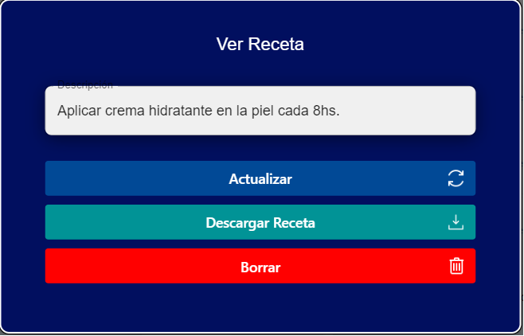
*Gestión de Recetas*

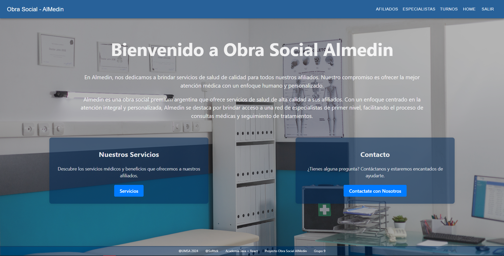
*Home*

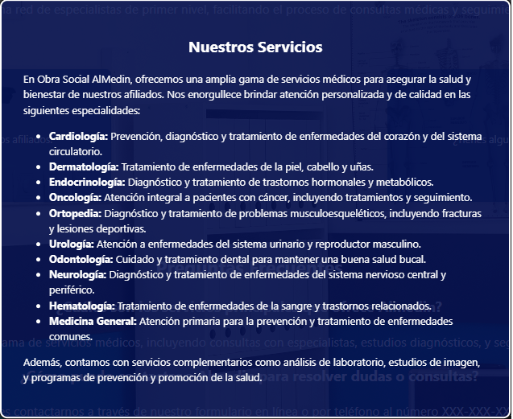
*Servicios ofrecidos por la Obra Social*


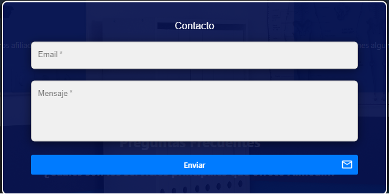
*Contacto de la obra social*


## ¡Terminamos!

Cualquier duda o recomendación que quieran a hacer pueden hacerla y responderemos a la brevedad.

¡Gracias por visitar nuestro proyecto FullStack de la Obra Social Almedin!


